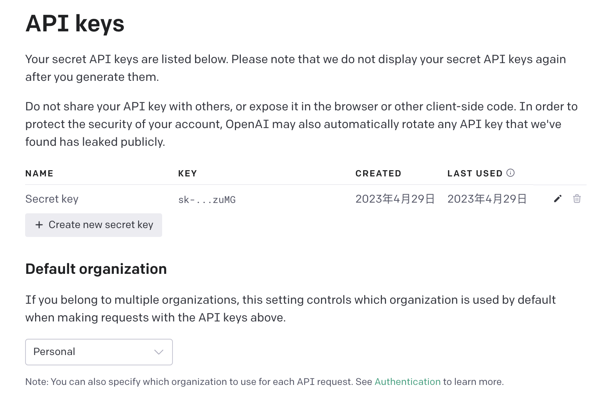

# 国内最安全的使用chatgpt的方式，没有之一

## 1.准备[腾讯云函数](https://url.cn/EmepAnBz)
> 腾讯云函数，有3个月的免费试用期，3个月以后10元/月
## 2.准备[APIkey](https://platform.openai.com/account/api-keys)
> 准备openai的key，在控制台点击生成即可

## 3.准备插件ChatHub
> 浏览器上安装插件ChatHub
## 4.腾讯云上构建云函数
> 腾讯云上构建好云函数，然后记录可以访问的地址
## 5.ChatHub中配置
> 5.1 配置APIkey\
> 5.2 配置云函数访问地址

[返回](README.md)